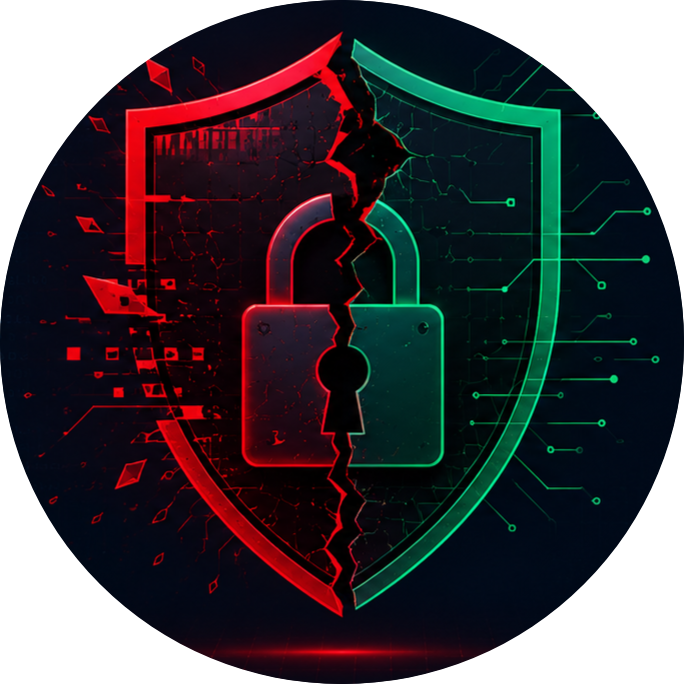
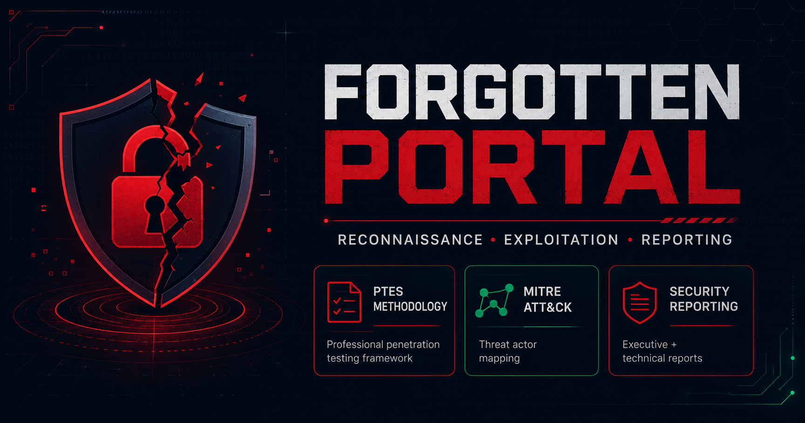
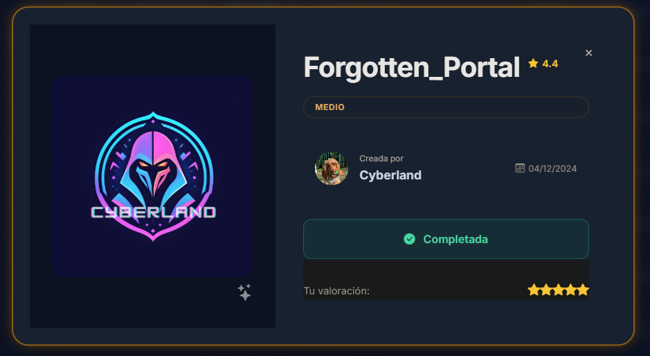
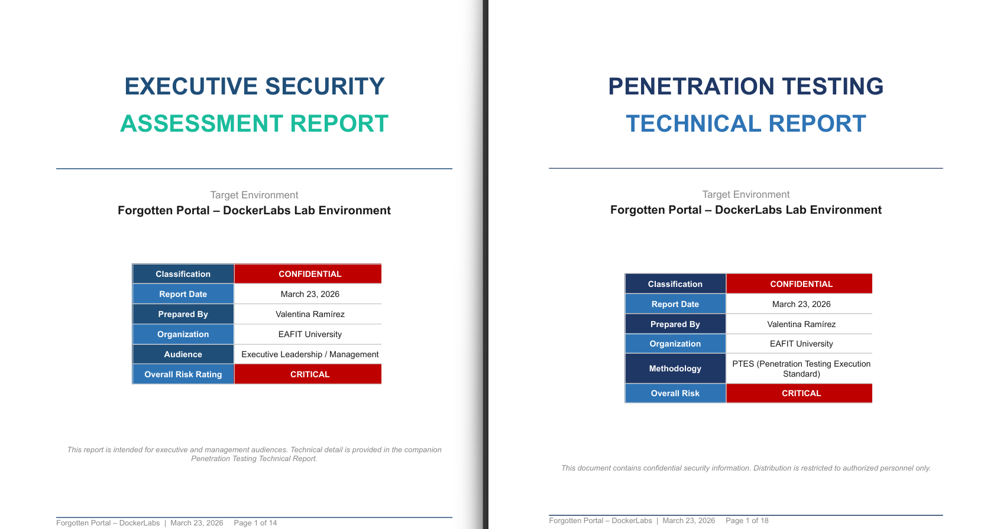
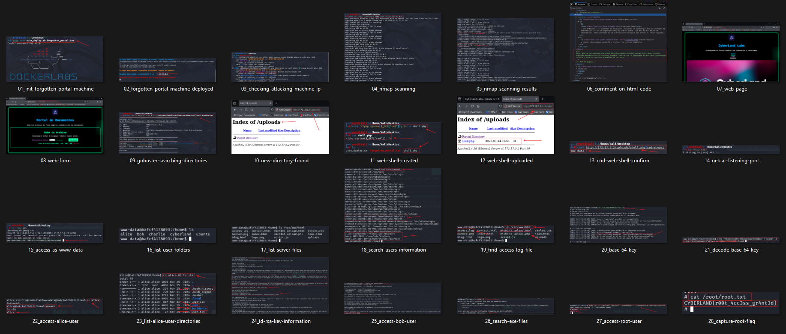
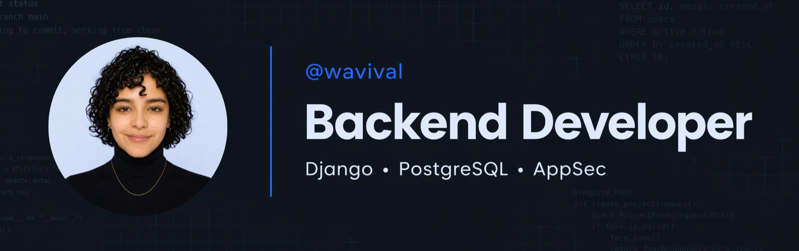

<h1 align="left">
  
  Forgotten Portal • Penetration testing
</h1>



[](https://blog.luminaw.co/forgotten-portal-pentesting-dockerlabs/)
[](https://wavival.dev)

> Full penetration testing documentation for the **Forgotten_Portal** machine from [DockerLabs](https://dockerlabs.es), developed as part of the cybersecurity accelerator at Nodo EAFIT (2026).

## Attack Chain • Forgotten Portal

End-to-end penetration test of a vulnerable Docker-based machine. Full kill chain from zero to root: reconnaissance, enumeration, vulnerability exploitation, and privilege escalation, achieving full system compromise without credentials or advanced exploits.

1. Sensitive data exposed in HTML source code → revealed hidden upload page
2. File upload form accepting `.php` → Remote Code Execution via web shell
3. Credentials stored in Base64 inside access log → lateral movement to `alice`
4. Shared RSA key across all system users → lateral movement to `bob`
5. Misconfigured sudo permissions on `tar` → privilege escalation to `root`

[Writeup](https://blog.luminaw.co/forgotten-portal-pentesting-dockerlabs/) • [Laboratory](https://dockerlabs.es)

Used tools: `NMAP` `Gobuster` `Netcat` `Python` `Base64` `GTFOBins` `MITRE ATT&CK` `PTES` `DockerLabs` `Linux`



## Reports • Technical & Executive

Two deliverables aligned to different audiences: a technical report documenting every step, payload, and finding for security teams, plus an executive report translating impact and remediation priorities for non-technical stakeholders.

Methodology follows PTES (Penetration Testing Execution Standard) with findings mapped to the MITRE ATT&CK framework.

[Technical Report](reports/technical-report.pdf) • [Executive Report](reports/executive-report.pdf) • [MITRE ATT&CK Mapping](notes/mittre-attack-mapping.md)

Used tools: `PTES` `MITRE ATT&CK` `Markdown` `PDF`



## Evidence • Full Capture Walkthrough

28 annotated screenshots covering the full attack chain, from initial machine deployment and network discovery to web shell upload, lateral movement across users, and root flag capture. Each step is reproducible and tied to the technical report.

Repository structure:

```
forgotten-portal-writeup/
├── evidence/                       # 28 annotated screenshots, full attack chain.
├── notes/
│   ├── writeup.md                  # Step-by-step technical walkthrough with images.
│   └── mittre-attack-mapping.md    # Full MITRE ATT&CK TTP mapping.
└── reports/
    ├── technical-report.pdf        # Full technical report (Spanish).
    └── executive-report.pdf        # Executive summary for non-technical stakeholders.
```

[Evidence folder](evidence/) • [Step-by-step writeup](notes/writeup.md)

Used tools: `Linux` `Bash` `Markdown` `Screenshots`



## License

Released under the MIT License. Free to use, modify, and redistribute with attribution. Full terms in [LICENSE](LICENSE).

## Contact



<h3 align="left">
  
  Valentina Ramírez • @wavival
</h3>

> Thanks for getting here. Let's build great things.

[](https://www.linkedin.com/in/wavival)
[](https://www.instagram.com/wavival)
[](mailto:wavival.dev@luminaw.co)
